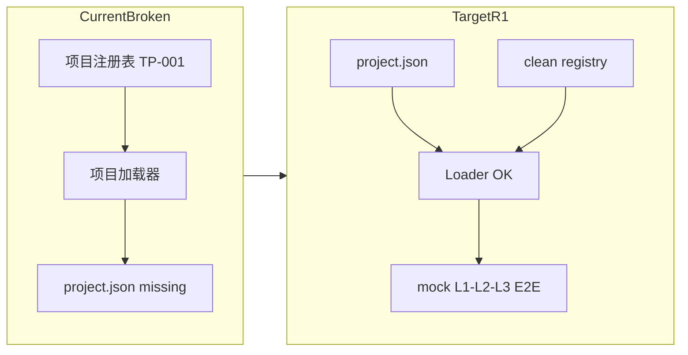
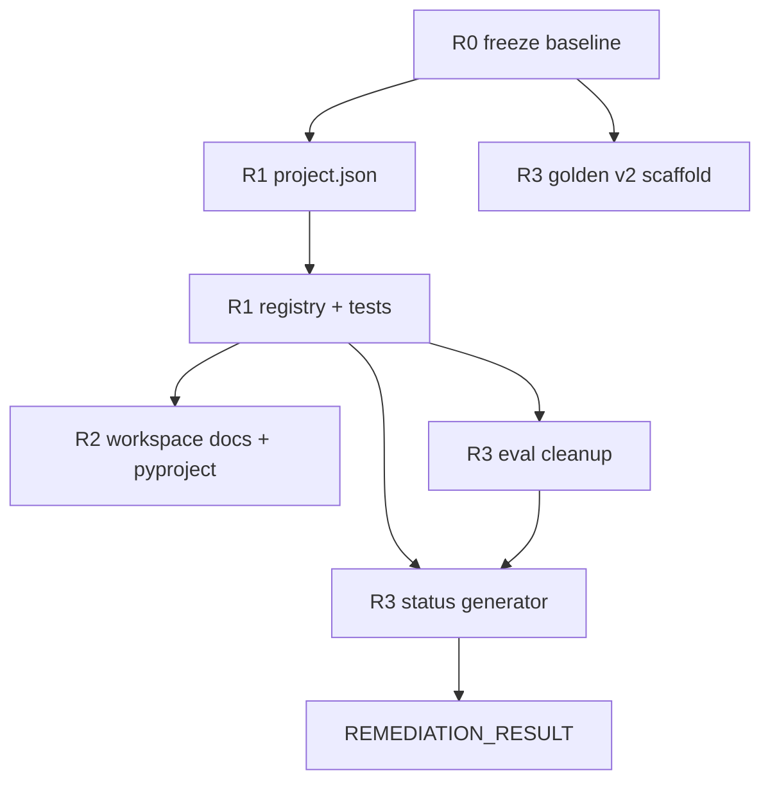

# XC-UE 基础整改计划（R0–R3，Workspace-Only）

## 背景与约束

你已确认：
- **范围**：R0–R3（不做 R4 L2/L3 统一、不做 R5 生产资格评审、不做第三次全量 API 评估）
- **R2 形态**：**方案 B — workspace-only**（保留 [`00_工程总控/工程执行层/`](00_工程总控/工程执行层/) 为唯一运行真源，不将 L1/L2/L3 迁入 `src/xc_ue/`）

当前阻断事实（审计 100% 置信）：
- [`项目注册表.json`](00_工程总控/工程执行层/项目注册表.json) 默认 `TP-001`，但 [`70_测试项目/TP-001_CleanHarness_IR_Runtime/`](70_测试项目/TP-001_CleanHarness_IR_Runtime/) **无** `project.json` → exit 27
- [`pyproject.toml`](pyproject.toml) wheel 仅含 3 个壳文件，[`xc_ue/cli.py`](src/xc_ue/cli.py) 只有 `--health`/`--version`
- 根文档仍写 2026-06-16「禁止跑 L1」，与 Phase 2A 现实冲突
- [`脚本/评估_L1_语义金标准.py`](脚本/评估_L1_语义金标准.py) L29/L394–402 硬编码 GS-001/GS-005 与 magic run-id



---

## R0：冻结证据（~0.5 天）

**目标**：建立可复现审计基线，冻结 golden v1 / 提示词 / 标签，禁止在整改期间继续「为通过校准而改样本」。

### 交付物

| 产物 | 路径 | 说明 |
|------|------|------|
| 基线脚本 | [`脚本/冻结审计基线.py`](脚本/冻结审计基线.py) | 生成 baseline + 辅助冻结记录 |
| 审计基线 | [`审计纠偏_2026-06-26/AUDIT_BASELINE.json`](审计纠偏_2026-06-26/AUDIT_BASELINE.json) | 整改前快照；**R3 不得覆盖** |
| 运行时快照 | [`审计纠偏_2026-06-26/RUNTIME_SNAPSHOT.json`](审计纠偏_2026-06-26/RUNTIME_SNAPSHOT.json) | pytest 执行结果；**不参与 baseline_digest** |
| 冻结记录 | [`tests/fixtures/l1_semantic_golden/FREEZE_RECORD.json`](tests/fixtures/l1_semantic_golden/FREEZE_RECORD.json) | `frozen`、`baseline_ref`；**不在 v1 manifest** |
| 校准计划 | [`tests/fixtures/l1_semantic_golden/CALIBRATION_PLAN.json`](tests/fixtures/l1_semantic_golden/CALIBRATION_PLAN.json) | `calibration_subset`；**不在 v1 manifest** |

### AUDIT_BASELINE.json 字段

| 字段 | 来源 / 规则 |
|------|-------------|
| `baseline_state` | `INTEGRATED_CANDIDATE_WITH_BLOCKERS` / `CURRENT_STATE_A2_MINUS` |
| `generated_at` | ISO 时间戳（**volatile**，不参与 digest） |
| `baseline_digest` | SHA-256 of canonical JSON `stable_payload`（见下） |
| `stable_payload` | 除 `generated_at`、`pytest_execution` 时间戳等 volatile 字段外的全部可复现事实 |
| `git_commit` | `git rev-parse HEAD`（无 git → `null` + 警告） |
| `git_status_porcelain` | `git status --porcelain=v1` 完整输出（行数组） |
| `git_dirty_files` | porcelain 解析出的脏文件路径列表 |
| `git_dirty_diff_hash` | `git diff` + `git diff --cached` 合并内容的 SHA-256 |
| `pytest_collection` | `pytest --collect-only -q`：**完整 nodeid 列表** + `count`（**禁止硬编码固定数量如 66**） |
| `pytest_execution` | 全量 `pytest` 的 pass/fail/summary（**记录实际运行结果**，不断言固定通过数） |
| `golden_v1_hashes` | **全部** golden v1：`chapters/*.md`、`labels/*.json`（含 `SCHEMA.labels.json`）、`paragraph_maps/*.json`、`manifest.json` — 每项 path + sha256 |
| `rules_schemas_hashes` | [`公共组件/结构定义/*.json`](00_工程总控/工程执行层/公共组件/结构定义/) + `gate_rules.json` / `ability_rules.json` / `routes.json` / `protocol_rules.json` |
| `governed_prompt_evaluator_hashes` | L1/L2/L3 提示词/标尺 `.py`、[`语义证据校验.py`](00_工程总控/工程执行层/公共组件/语义证据校验.py)、eval/validate 脚本等白名单 |
| `api_archive_index` | [`审计纠偏_2026-06-26/L1_Phase2A_首次真实API评估/`](审计纠偏_2026-06-26/L1_Phase2A_首次真实API评估/) 文件名 + SHA-256 |
| `freeze_policy` | v1 golden / Phase 2A 归档 **只读**；R3 不改 v1 manifest |

### baseline_digest 规则（修订 #1）

- `generated_at` 可在两次运行间变化；**不得**要求完整 JSON 字节相等。
- 脚本从 payload 构建 `stable_payload`：排除 `generated_at`、`pytest_execution.duration_seconds`（若有）等 volatile 字段。
- 两次运行 **仅** `baseline_digest` 必须一致（同一干净工作树、同一 git commit）。

### pytest 记录规则（修订 #2）

- 使用 `pytest --collect-only -q` 采集 **全部 nodeid** 与 **实际 count**。
- 运行全量 pytest 并记录 exit code、`passed`/`failed`/`skipped`/`errors` 等 summary。
- 计划文档与 baseline **禁止**写死「66 tests」或断言固定通过数。

### Golden v1 冻结分离（修订 #5）

- **R3 不得**在 [`manifest.json`](tests/fixtures/l1_semantic_golden/manifest.json) 增加 `frozen` / `baseline_ref` / `calibration_subset`。
- 冻结元数据 → [`FREEZE_RECORD.json`](tests/fixtures/l1_semantic_golden/FREEZE_RECORD.json)。
- 校准子集 → [`CALIBRATION_PLAN.json`](tests/fixtures/l1_semantic_golden/CALIBRATION_PLAN.json)（R3 eval 改读此文件）。

### 验收

- 脚本可重复运行：**`baseline_digest` 稳定**（非整文件 JSON 相等）
- 生成 `FREEZE_RECORD.json` + `CALIBRATION_PLAN.json`
- **整改期间禁止**：改 GS-001/GS-005 标签、改 L1 提示词追校准、发起第三次全量 API

---

## R1：恢复默认项目闭环（1–2 天）

**目标**：`--project TP-001`（或零配置默认）可加载；注册表干净；有分层自动化证明。

### 1. 补齐 TP-001 `project.json`

在 [`70_测试项目/TP-001_CleanHarness_IR_Runtime/project.json`](70_测试项目/TP-001_CleanHarness_IR_Runtime/project.json) 新增清单，对齐 [`项目加载器.py`](00_工程总控/工程执行层/公共组件/项目加载器.py) 的 `xcue.project-manifest/1.0` 校验逻辑。

同步更新项目说明、Harness README；可选增强 [`ProjectHarness运行校验.py`](00_工程总控/工程执行层/L3工程/ProjectHarness运行校验.py)。

### 2. `chapter_sequence` 校验（修订 #6）

在 loader 或 manifest 校验中强制：

- 每项路径在 `content_root` 下、文件存在、为文件（非目录）
- 无重复项
- **拒绝**绝对路径与 `../` 路径逃逸

新增 **负向/反向测试**：非法 sequence → 明确阻断码。

### 3. 清理注册表测试别名

- 从 [`项目注册表.json`](00_工程总控/工程执行层/项目注册表.json) 移除 `pytest` / `pytest-M0`
- 新建 [`tests/fixtures/project_registry.json`](tests/fixtures/project_registry.json) 供测试注入

### 4. 分层集成测试（修订 #7、#8）

新建 [`tests/test_TP001_默认项目.py`](tests/test_TP001_默认项目.py)：

| 层级 | 用例 | 断言 |
|------|------|------|
| (a) 项目加载 | `加载项目(ROOT, "TP-001")` | 无 `PROJECT_RESOLUTION_FAILED`；manifest 字段一致 |
| (b) 无 API 阻断 | 统一入口启动（mock transport） | 无 API 相关 block reason |
| (c) Mock E2E | **in-process** 调用 `main()` / `_run_entry` | mock L1→L2→L3 闭环 |

**禁止**声称 subprocess 继承 monkeypatch。subprocess 仅用于 **真实启动 smoke**（exit ≠ 27），mock E2E 必须 **进程内** 调用。

### 5. R1 文档最小更新

- 根 README：删除「禁止跑 L1」；更新阶段说明
- INDEX：移除不存在路径引用
- `当前系统状态_旧版.md` 顶部 DEPRECATED 横幅

### R1 验收

```bash
# smoke：非 exit 27（非 mock E2E 主验收）
python 00_工程总控/工程执行层/统一运行入口.py --target L1 --project TP-001 --chapter ...

python -m pytest tests/test_TP001_默认项目.py -q
# → 三层验收分别 pass
```

---

## R2：明确 Workspace-Only 工程形态（1–2 天）

**目标**：消除「pip install = 完整引擎」误导；运行路径单一清晰。

### 1. 调整 [`pyproject.toml`](pyproject.toml)

- `pytest` 移入 `[project.optional-dependencies] dev`
- `runtime` = `PyYAML`, `jsonschema`
- **xcue stub CLI（修订 #10）**：无参数时 **exit 2**；**不得**打印 help 并 return 0（成功假象）

### 2. README editable install（修订 #9）

准确表述：

- `pip install -e ".[dev,runtime]"` 安装 **workspace stub + 开发/运行时 extras**
- **真实引擎**仍通过仓库内 [`统一运行入口.py`](00_工程总控/工程执行层/统一运行入口.py) 运行
- wheel **不是**产品交付物

### R2 验收

- 新开发者：clone → `pip install -e ".[dev,runtime]"` → `python 统一运行入口.py`
- `xcue` 无参 → exit 2，非 0
- `pytest` 不在默认 runtime 依赖中

---

## R3：重建评估可信度（2–4 天，不含新 API 全量跑）

**目标**：评估器无样本专属分支；golden v1 已冻结；启动 v2；语义字段诚实命名；状态机器生成。

### 1. 清理 [`脚本/评估_L1_语义金标准.py`](脚本/评估_L1_语义金标准.py)

| 删除/替换 | 替代设计 |
|-----------|----------|
| `CALIBRATION_CHAPTER_IDS = ("GS-001", "GS-005")` | 从 [`CALIBRATION_PLAN.json`](tests/fixtures/l1_semantic_golden/CALIBRATION_PLAN.json) 读 `calibration_subset` |
| magic run-id 分支 | run-id 仅归档；`--require-calibration-pass` + `--chapter-id` |

**不得**修改 v1 [`manifest.json`](tests/fixtures/l1_semantic_golden/manifest.json)。

### 2. Golden v1 冻结 + v2 脚手架（修订 #12）

**v1（只读）**：[`FREEZE_RECORD.json`](tests/fixtures/l1_semantic_golden/FREEZE_RECORD.json) 已 R0 建立；更新 README 声明禁止 retroactive 编辑。

**v2（新建目录）**：
- [`tests/fixtures/l1_semantic_golden_v2/`](tests/fixtures/l1_semantic_golden_v2/)
- **规模**：**最少 10 章**，**推荐 12 章**
- **额外 2 章（11、12）目的**：覆盖 v1 五类场景各 ≥2 样本后的 **边界/对抗扩展**（独立 `clear_fail` 负例、BORDERLINE 双盲复核槽位），不再复用 GS-005
- `labeling_protocol.md`（双盲、BORDERLINE、与 v1 隔离）

### 3. 语义证据字段（修订 #11）

在 [`语义证据校验.py`](00_工程总控/工程执行层/公共组件/语义证据校验.py)：

- **保留** `evidence_semantically_sufficient` 作 **deprecated 兼容字段**
- **新增** `evidence_protocol_compliant`
- **新增** `semantic_support: null`（预留，当前不承诺语义裁判）
- adversarial 用例文档化 protocol vs semantic 已知限制

### 4. 状态生成 vs 运行时快照（修订 #13）

| 产物 | 路径 | 行为 |
|------|------|------|
| 生成状态 | `00_工程总控/当前系统状态_自动生成.md` | 默认 **不主动跑 pytest**；读 baseline / 文件探测 |
| 运行时快照 | 独立文件（如 `RUNTIME_SNAPSHOT.json`） | 可选 `--refresh-tests` 时更新 |

[`脚本/生成当前系统状态.py`](脚本/生成当前系统状态.py) 输入：`AUDIT_BASELINE.json`、TP-001 manifest、golden FREEZE_RECORD、git、production_eligible 探测。

### 5. R3 完成产物（修订 #14）

整改完成后新增 [`审计纠偏_2026-06-26/REMEDIATION_RESULT_R0_R3.json`](审计纠偏_2026-06-26/REMEDIATION_RESULT_R0_R3.json)：

- 记录 R0–R3 验收结果、post-remediation pytest summary、指向 R0 `AUDIT_BASELINE.json`
- **不得覆盖** R0 整改前 [`AUDIT_BASELINE.json`](审计纠偏_2026-06-26/AUDIT_BASELINE.json)

### R3 验收

- `grep -r "GS-001\|GS-005" 脚本/评估_L1_语义金标准.py` → 无硬编码 chapter ID（测试/fixture 除外）
- `python 脚本/生成当前系统状态.py` → 与仓库事实一致（默认不跑 pytest）
- `python 脚本/校验_L1_语义金标准.py` → `VALIDATION_OK`
- **不执行**第三次全量真实 API 评估
- `REMEDIATION_RESULT_R0_R3.json` 存在且 `AUDIT_BASELINE.json` 未被改写

---

## 执行顺序与依赖



**建议 PR 切分**：
1. R0 baseline script + JSON + FREEZE_RECORD + CALIBRATION_PLAN
2. R1 project.json + registry + tests
3. R2 pyproject + README 运行形态
4. R3 eval + golden v2 + status + REMEDIATION_RESULT

---

## 明确不在本次范围（R4+）

- L2 枚举路由 / L3 PLAN_ONLY 分离（R4）
- `TP-REAL-001` 三章真实压测（R4）
- 引擎迁入 `src/xc_ue` 或可安装 wheel 含规则 Schema（已否决）
- `production_eligible=true` 评审（R5）
- 第三次 Phase 2A 全量 API 与 GS-001/GS-005 提示词微调

---

## 风险与缓解

| 风险 | 缓解 |
|------|------|
| 本地工作树与历史 ZIP 测试数不一致 | R0 记录 collect-only **完整 nodeid 列表**与 count；整改后对比 baseline |
| 删除 `xcue` CLI 破坏现有脚本 | stub CLI exit 2 + 文档指向统一入口 |
| golden v2 12 章工作量过大 | R3 只交付 v2 **规范+目录壳**；样本采集列为后续里程碑 |
| TP-001 占位正文无法验证语义 | R1 只验证加载/E2E 链路；语义能力仍靠 golden v1 + 单元测试 |
| R0/R3 baseline 混淆 | `AUDIT_BASELINE.json` 只 R0 写入；R3 写 `REMEDIATION_RESULT_R0_R3.json` |

---

## 冻结前最终实施约束（强制）

以下约束覆盖 R0–R3 全部实施；R0 脚本与验收必须先行满足 1–3、6。

### 1. 写文件前采集工作树；排除自身产物

[`脚本/冻结审计基线.py`](脚本/冻结审计基线.py) **必须先**采集 git 状态、diff、未跟踪文件哈希，**再**写入任何产物。从 git 视图精确排除：

- `审计纠偏_2026-06-26/AUDIT_BASELINE.json`
- `tests/fixtures/l1_semantic_golden/FREEZE_RECORD.json`
- `tests/fixtures/l1_semantic_golden/CALIBRATION_PLAN.json`
- `审计纠偏_2026-06-26/RUNTIME_SNAPSHOT.json`
- `审计纠偏_2026-06-26/REMEDIATION_RESULT_R0_R3.json`

### 2. git status -z + 未跟踪文件逐文件 SHA-256

使用 `git status --porcelain=v1 -z` 解析状态。未跟踪文件除记录路径外，**必须逐文件**计算 SHA-256；仅 `git diff` / `git diff --cached` **不足以**覆盖未跟踪内容。

### 3. baseline_digest 与 runtime_observation 分离

`baseline_digest` **只**覆盖 `stable_payload`。`pytest_collection` 的**排序后 nodeids** 可进入 `stable_payload`；完整 pytest 执行结果放入 `runtime_observation`（及 `RUNTIME_SNAPSHOT.json`），**不参与** `baseline_digest`。

### 4. R1 测试四层拆分

| 层级 | 方式 | 断言 |
|------|------|------|
| 真实 smoke | subprocess 启动统一入口，无 API Key | 允许 `API_UNAVAILABLE` / `AUDIT_BLOCKED`；**项目解析必须成功**，不得 exit 27 |
| mock L1 | 进程内 `main()` | 不得出现 API 阻断 |
| mock L1→L2→L3 | 进程内 `main()` | 完整闭环 |
| subprocess | 仅真实启动 smoke | **不声称**继承 monkeypatch |

### 5. chapter_sequence 路径安全（R1 loader）

路径先 `resolve`，再验证位于 resolved `content_root` 内。拒绝：绝对路径、`../` 逃逸、符号链接/目录联接逃逸、缺失文件、目录项、重复项。Windows 重复检查使用 **normcase 后的 resolved 路径**。

### 6. CALIBRATION_PLAN 与 golden v1 哈希边界

[`CALIBRATION_PLAN.json`](tests/fixtures/l1_semantic_golden/CALIBRATION_PLAN.json) 属于**可变控制文件**，**不属于** golden v1 冻结语料；**不得**计入 `golden_v1_hashes`。`FREEZE_RECORD.json` **不得**产生自引用哈希（不哈希自身内容进入 baseline）。

### 7. 未来评估归档元数据（R3 eval）

所有**新增**评估归档必须包含：

`dataset_id`、`dataset_version`、`baseline_digest`、`git_commit`、`git_dirty`、`evaluator_version`、`response_schema_version`、`prompt_hashes`、`label_hashes`

### 8. 样本专属字符串扫描（R3）

扫描范围：L1 生产代码、[`语义证据校验.py`](00_工程总控/工程执行层/公共组件/语义证据校验.py)、eval/validate 脚本。**仅允许**在 `tests/`、`fixtures/`、历史归档、[`CALIBRATION_PLAN.json`](tests/fixtures/l1_semantic_golden/CALIBRATION_PLAN.json) 中出现样本 ID（如 GS-001、GS-005）。

### 9. R2 干净临时虚拟环境验收

```bash
pip install -e ".[runtime]"
python -m pip check
python 00_工程总控/工程执行层/统一运行入口.py --help
```

`runtime` extras 以**实际生产导入**为准，不预设仅 PyYAML 与 jsonschema。

### 10. R0 执行边界（本轮）

完成上述约束后直接执行 R0。**不得**扩大计划范围、**不得**进入 R4、**不得**第三次真实全量 API、**不得**修改 golden v1 正文与人工标签。
